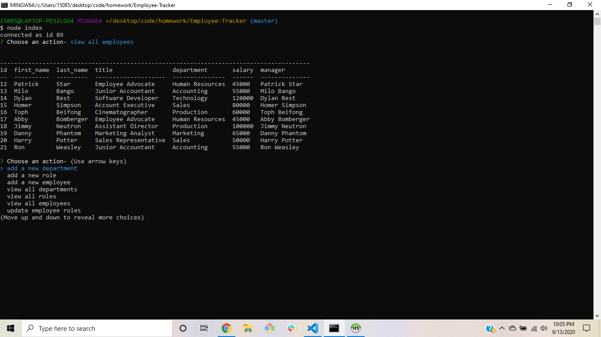
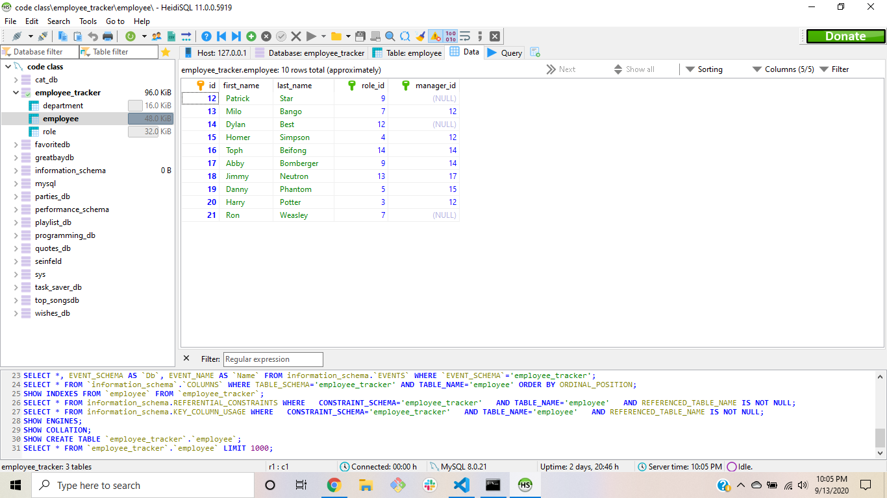

# Employee-Tracker
This application allows the user to add to, view, and update a SQL database with three tables: Department, Role, and Employee. The tables consist of employee infomration such as salaries and managers while also including roles and departments foreign keys. Using Node.js, the user can follow Inquirer NPM prompts to display navigate the database and display or alter information. This app utilizies MySQL, Inquirer NPM, and console.table NPM to make the user experience efficient and intuitive.

## Built With
- <a href="https://www.mysql.com/">MySQL</a>
- <a href="https://www.npmjs.com/package/inquirer">Inquirer NPM</a>
- <a href="https://www.npmjs.com/package/console.table">console.table NPM</a>

## Screenshots

## License
Copyright ©2020 Dylan Best

Permission is hereby granted, free of charge, to any person obtaining a copy of this software and associated documentation files (the "Software"), to deal in the Software without restriction, including without limitation the rights to use, copy, modify, merge, publish, distribute, sublicense, and/or sell copies of the Software, and to permit persons to whom the Software is furnished to do so, subject to the following conditions:

The above copyright notice and this permission notice shall be included in all copies or substantial portions of the Software.

THE SOFTWARE IS PROVIDED "AS IS", WITHOUT WARRANTY OF ANY KIND, EXPRESS OR IMPLIED, INCLUDING BUT NOT LIMITED TO THE WARRANTIES OF MERCHANTABILITY, FITNESS FOR A PARTICULAR PURPOSE AND NONINFRINGEMENT. IN NO EVENT SHALL THE AUTHORS OR COPYRIGHT HOLDERS BE LIABLE FOR ANY CLAIM, DAMAGES OR OTHER LIABILITY, WHETHER IN AN ACTION OF CONTRACT, TORT OR OTHERWISE, ARISING FROM, OUT OF OR IN CONNECTION WITH THE SOFTWARE OR THE USE OR OTHER DEALINGS IN THE SOFTWARE.

## Authors
- **Dylan Best** - [dylanbest15](https://github.com/dylanbest15)